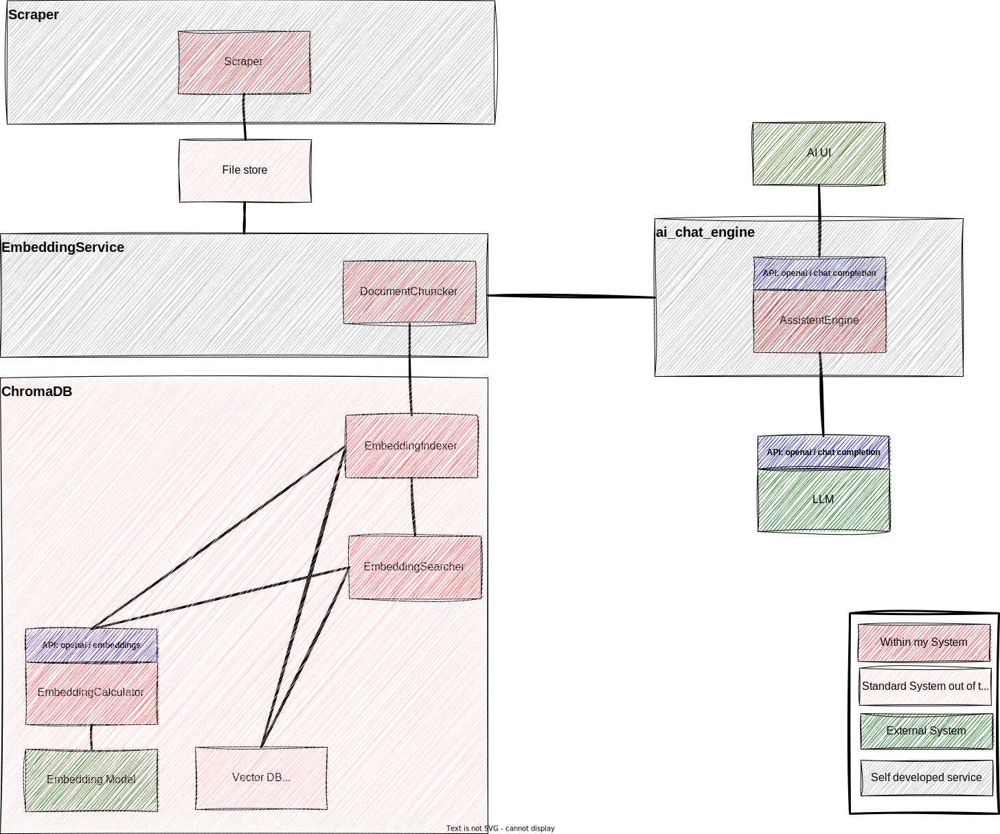

# ai_chat_engine

In a global [document chat system]() this component contains the `ai_chat_engine` component.



## Functions, API, dependencies

The `ai_chat_engine` offers a OpenAI based API so [clients](https://github.com/topics/openai-api) can consume it.

## Run it

In order to run the code:

```bash
cd src
pip installs -r requirements
uvicorn main:app --host 0.0.0.0 --port 8080 --reload  
```

## Technical stuff
* The package [pydantic-openai](https://github.com/stillmatic/pydantic-openai/tree/main) could help
* New approach: I just build the endpoints that are needed, starting with [`chat/completions`](https://platform.openai.com/docs/api-reference/chat/create)
* I had to change the plan, as generating did not work
*  ~~In order to ensure we provide the [OpenAI API](https://platform.openai.com/docs/api-reference) we generate the base code of this server from the [OpenAI OpenAPI definition](https://github.com/openai/openai-openapi).~~
* In order to generate the server structure, check the [OpenAPI generators](https://openapi-generator.tech/docs/installation), more specifically the [FastAPI Generator](https://openapi-generator.tech/docs/generators/python-fastapi).

## Possible clients

* [ChatWizard](https://github.com/lisiur/ChatWizard) on Mac
* 